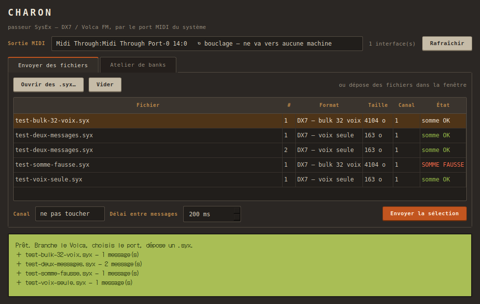
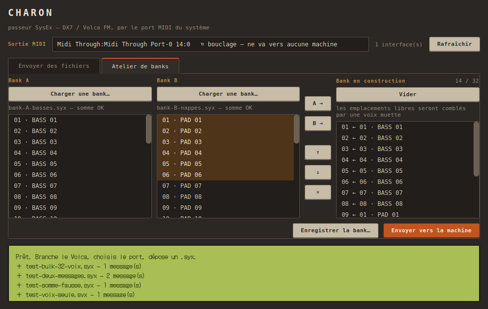

# Charon — passeur SysEx vers Volca FM

Application de bureau qui envoie des patches **SysEx DX7 / Volca FM** vers la
machine par un port MIDI réel, et qui compose des banks sur mesure.

**Pourquoi elle existe :** le loader SysEx d'AZA passe par la Web MIDI API, qui
n'existe qu'en contexte sécurisé — donc en https, donc par le tunnel. En studio,
devant la machine, dépendre d'un tunnel pour parler à un appareil posé sur le
bureau est absurde. Charon ouvre directement le port MIDI du système.



## Installer et lancer

Une seule dépendance à avoir soi-même : [uv](https://docs.astral.sh/uv/).
Il se charge de Python et du reste.

```bash
git clone https://github.com/obareau/charon.git
cd charon
uv run charon
```

| Système | Couche MIDI | Notes |
|---|---|---|
| **Linux** | ALSA / JACK | `libasound2-dev` requis si la roue `python-rtmidi` doit être construite |
| **macOS** | CoreMIDI | rien à installer, le Volca apparaît dès qu'il est branché |
| **Windows** | WinMM | — |

## Onglet « Envoyer des fichiers »

- liste les **ports MIDI réels** du système, avec suivi des branchements à chaud
- ouvre des `.syx` par le sélecteur ou par **glisser-déposer**
- **sépare les messages** quand un fichier en contient plusieurs, et ignore le
  rembourrage que certains exportateurs intercalent
- reconnaît les formats DX7 — **bulk 32 voix** (4104 o) et **voix seule** (163 o) ;
  le reste passe quand même, annoncé comme brut
- **vérifie la somme de contrôle avant d'envoyer** : un fichier abîmé se voit
  dans la table plutôt que de charger un patch corrompu dans la machine
- **force le canal MIDI** sans invalider le fichier
- temporise entre messages, réglable

## Onglet « Atelier de banks »



Charge deux banks, pioche dedans, compose la troisième — puis enregistre-la en
`.syx` ou envoie-la directement.

⚠️ **Les voix sont recopiées telles quelles, jamais réencodées.** Une bank DX7,
ce sont 32 voix de 128 octets à la suite (le nom dans les 10 derniers octets de
chacune) ; composer revient à en choisir 32 et à recalculer la somme de
contrôle. Aucun paramètre n'est interprété, donc le patch qui arrive dans la
machine est bit pour bit celui qui est parti de la bank d'origine.

Moins de 32 voix choisies : les emplacements libres reçoivent une voix muette.
Un bulk de moins de 32 voix n'existe pas — la machine le rejetterait.

## Ce que Charon ne fait jamais

**Découper un message.** Un SysEx tronqué en vol n'est pas un SysEx, c'est du
bruit que l'appareil rejette. Le délai réglable sépare deux messages, jamais les
morceaux d'un seul : 4104 octets font déjà ~1,3 s à 31250 bauds.

## Tests

```bash
uv run --with pytest pytest tests/ -v
```

21 tests, dont un d'intégration qui envoie un vrai dump de 4104 octets par le
port de bouclage MIDI et vérifie qu'il revient identique. Il s'ignore
proprement là où ce port n'existe pas (macOS, Windows).

ℹ️ Les tests n'importent jamais Qt : ils tournent sans écran, ce qui permet de
les passer sur les trois systèmes en intégration continue.

## Documentation

| Document | Contenu |
|---|---|
| [`docs/format-sysex.md`](docs/format-sysex.md) | Le format DX7 tel que Charon le connaît — et ce qu'il ignore délibérément |
| [`docs/architecture.md`](docs/architecture.md) | Les quatre modules, et pourquoi le noyau ignore Qt |
| [`docs/depannage.md`](docs/depannage.md) | Symptômes réels et leurs causes |
| [`CLAUDE.md`](CLAUDE.md) | Repères pour travailler sur le code |

## Licence

MIT pour le code.

La police de l'écran, **[DotGothic16](https://github.com/fontworks-fonts/DotGothic16)**
de Fontworks, est embarquée sous **SIL Open Font License 1.1** — texte complet
dans [`charon/assets/fonts/OFL.txt`](charon/assets/fonts/OFL.txt).

Elle est incluse dans le dépôt plutôt que téléchargée à l'installation : le
rendu doit être le même sur les trois systèmes sans rien demander à personne.
C'est une matrice de points, pas un afficheur à segments — le DX7 a un LCD à
caractères, une police 7-segments serait un contresens.
